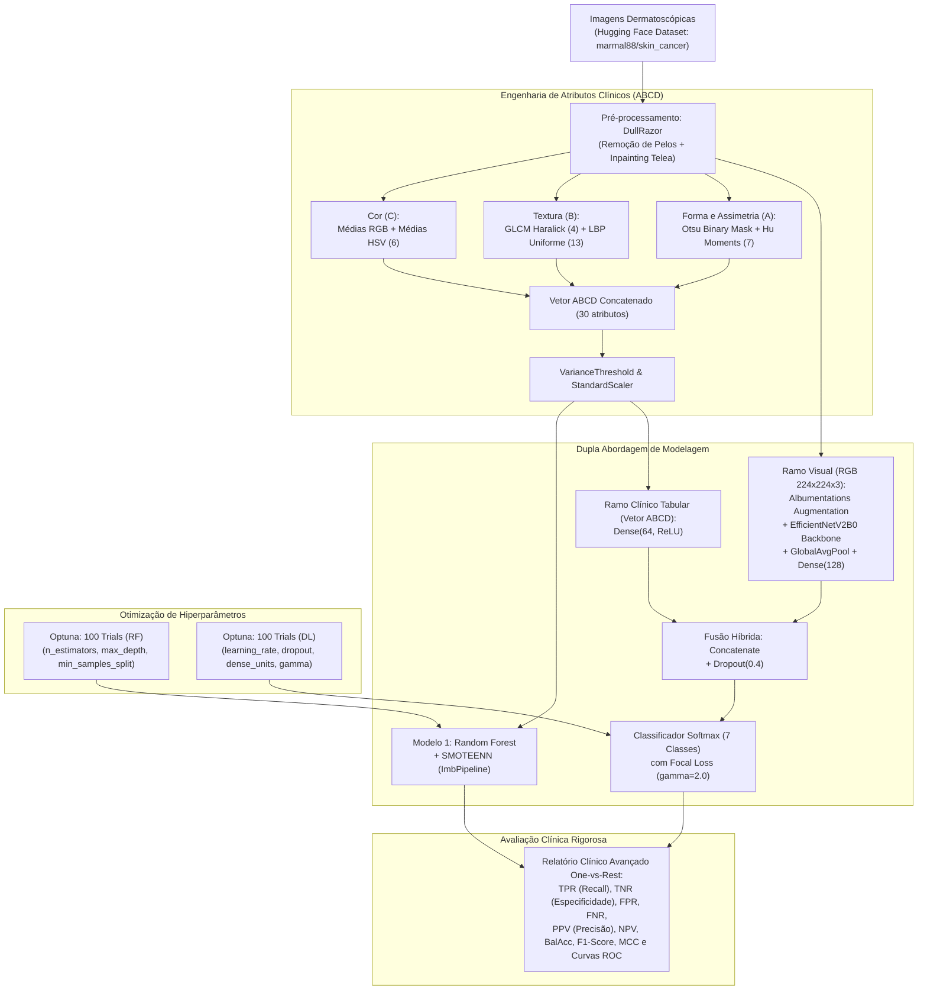

# 🔬 Detecção de Câncer de Pele: Engenharia de Features Progressiva e Visão Híbrida

[](https://www.python.org/)
[](https://tensorflow.org/)
[](https://scikit-learn.org/)
[](https://albumentations.ai/)
[](https://optuna.org/)
[](https://huggingface.co/datasets/marmal88/skin_cancer)
[](LICENSE)

> Sistema multimodal de auxílio ao diagnóstico dermatológico (**CAD - Computer-Aided Diagnosis**) integrando processamento de imagens biomédicas (DullRazor), extração clínica baseada na regra ABCD (HSV, GLCM, LBP, Hu Moments) e uma arquitetura de **Deep Learning Híbrida (EfficientNetV2B0 + Tabular ABCD)** com amostragem balanceada e Focal Loss.

---

## 📌 Sumário

- [Visão Geral e Motivação](#-visão-geral-e-motivação)
- [Classes de Lesões Dermatológicas](#-classes-de-lesões-dermatológicas)
- [Arquitetura do Pipeline](#-arquitetura-do-pipeline)
- [Engenharia de Features e Pré-processamento](#-engenharia-de-features-e-pré-processamento)
  - [1. Limpeza de Artefatos (DullRazor)](#1-limpeza-de-artefatos-dullrazor)
  - [2. Atributos Clínicos ABCD](#2-atributos-clínicos-abcd)
- [Estratégias de Modelagem](#-estratégias-de-modelagem)
  - [Random Forest Baseline com SMOTEENN](#random-forest-baseline-com-smoteenn)
  - [Rede Neural Híbrida (EfficientNetV2B0 + Vetor ABCD)](#rede-neural-híbrida-efficientnetv2b0--vetor-abcd)
  - [Tratamento de Desbalanceamento Extremo](#tratamento-de-desbalanceamento-extremo)
  - [Otimização Bayesiana com Optuna](#otimização-bayesiana-com-optuna)
- [Métricas Clínicas e Avaliação](#-métricas-clínicas-e-avaliação)
- [Resultados Comparativos](#-resultados-comparativos)
  - [Tabela Comparativa Consolidada](#tabela-comparativa-consolidada)
  - [Análise Crítica: O Impacto Clínico no Melanoma](#análise-crítica-o-impacto-clínico-no-melanoma)
  - [Tabelas Detalhadas de Desempenho por Classe (One-vs-Rest)](#tabelas-detalhadas-de-desempenho-por-classe-one-vs-rest)
- [Estrutura do Repositório](#-estrutura-do-repositório)
- [Como Reproduzir](#-como-reproduzir)
  - [Pré-requisitos](#pré-requisitos)
  - [Instalação das Dependências](#instalação-das-dependências)
  - [Execução](#execução)
- [Tecnologias Utilizadas](#-tecnologias-utilizadas)
- [Autoria e Créditos](#-autoria-e-créditos)

---

## 🩺 Visão Geral e Motivação

O câncer de pele é a neoplasia mais frequente no mundo. Entre seus tipos, o **melanoma cutâneo** destaca-se por seu alto potencial metastático e letalidade, embora apresente prognóstico favorável superior a 90% quando diagnosticado precocemente.

O diagnóstico dermatológico computacional enfrenta três desafios severos:
1. **Artefatos Visuais:** Pelos corporais e bolhas de ar que cruzam a lesão mascaram bordas e texturas cruciais.
2. **Desbalanceamento Extremo de Classes:** Casos benignos (ex.: *Melanocytic Nevi*) predominam em ordens de grandeza em relação a malignidades agressivas (*Melanoma*) ou subtipos raros (*Dermatofibroma*, *Vascular Lesions*).
3. **Assimetria de Custos Médicos:** Um **Falso Negativo (FN)** em melanoma pode custar a vida de um paciente que não receberá intervenção cirúrgica oportuna. Por outro lado, um **Falso Positivo (FP)** resulta apenas em biópsia confirmatória adicional, sendo amplamente preferível do ponto de vista clínico.

Este projeto propõe uma abordagem **híbrida e multidisciplinar**, unindo o conhecimento semântico e biomédico dos dermatologistas (atributos ABCD) ao poder de representação visual de redes neurais convolucionais modernas (**EfficientNetV2B0**), sob uma função de perda **Focal Loss** ajustada contra classes desbalanceadas.

---

## 🔬 Classes de Lesões Dermatológicas

O projeto analisa e classifica **7 categorias dermatológicas** (baseadas no benchmark **HAM10000**, consumido via streaming do dataset `marmal88/skin_cancer` no Hugging Face):

| Sigla | Nome Completo | Descrição Clínica |
| :--- | :--- | :--- |
| **akiec** | *Actinic Keratoses* | Lesões pré-cancerosas queratósicas induzidas por radiação solar crônica. |
| **bcc** | *Basal Cell Carcinoma* | Carcinoma basocelular, o câncer de pele mais comum, de crescimento lento. |
| **bkl** | *Benign Keratosis-like Lesions* | Lesões queratósicas benignas (ceratose seborreica, lentigos solares). |
| **df** | *Dermatofibroma* | Neoplasia cutânea mesenquimal benigna comum. |
| **nv** | *Melanocytic Nevi* | Pintas benignas comuns (classe majoritária no dataset). |
| **mel** | *Melanoma* | Neoplasia maligna agressiva derivada de melanócitos (classe mais crítica). |
| **vasc** | *Vascular Lesions* | Lesões vasculares cutâneas benignas (angiomas, granulomas piogênicos). |

---

## 📐 Arquitetura do Pipeline

O fluxo de dados contempla desde a ingestão streaming até a avaliação em matriz de confusão e métricas de diagnóstico clínico:



---

## 🛠️ Engenharia de Features e Pré-processamento

### 1. Limpeza de Artefatos (DullRazor)
Os pelos cutâneos geram ruídos de alta frequência e bordas falsas que prejudicam tanto os momentos de Hu quanto as convoluções profundas. A implementação do algoritmo **DullRazor** executa:
1. Conversão da imagem para escala de cinza.
2. Aplicação da transformação morfológica **Black-Hat** com elemento estruturante retangular $(9 \times 9)$, realçando estruturas finas e escuras (pelos).
3. Binarização da máscara por limiarização fixa.
4. Restauração da textura subjacente através do algoritmo de **Inpainting de Telea** (`cv2.INPAINT_TELEA`).

### 2. Atributos Clínicos ABCD
Para incorporar a semiótica dermatológica clássica da regra ABCD (*Asymmetry, Border, Color, Diameter*), 30 variáveis estatísticas e de visão clássica são extraídas:

- **Cor (C - 6 dimensões):** Médias dos canais nos espaços de cor **RGB** e **HSV**. O espaço HSV desacopla luminância de matiz, fornecendo invariância a variações de iluminação dos dermatoscópios.
- **Borda e Textura (B - 17 dimensões):**
  - **GLCM (Gray-Level Co-occurrence Matrix):** Cálculo das propriedades de Haralick — *contraste*, *homogeneidade*, *energia* e *correlação*.
  - **LBP (Local Binary Patterns):** LBP circular uniforme $(P=8, R=1)$ quantizado em um histograma de 13 *bins* normalizado por densidade.
- **Assimetria e Forma (A - 7 dimensões):**
  - Segmentação automática do núcleo da lesão via limiarização adaptativa de **Otsu**.
  - Cálculo dos **7 Momentos Invariantes de Hu**, transformados logaritmicamente ($\text{sgn}(hu) \cdot \log_{10}(|hu| + 10^{-12})$) para garantir invariância a escala, rotação e translação.

---

## 🧠 Estratégias de Modelagem

### Random Forest Baseline com SMOTEENN
- Treinado incrementalmente para demonstrar o ganho de acurácia à medida que novos blocos de atributos são introduzidos (A: Cor $\rightarrow$ B: Cor + Textura $\rightarrow$ C: Full ABCD + DullRazor).
- Aplicação do algoritmo híbrido **SMOTEENN** (*Synthetic Minority Over-sampling Technique* + *Edited Nearest Neighbours*), que gera amostras sintéticas realistas e limpa pontos ruidosos da fronteira de decisão.
- Encapsulado em um `ImbPipeline` durante a validação cruzada para **eliminar vazamento de dados (*data leakage*)**.

### Rede Neural Híbrida (EfficientNetV2B0 + Vetor ABCD)
A rede recebe duas entradas simultâneas:
1. **Entrada de Imagem $(224 \times 224 \times 3)$:** Processada pelo *backbone* pré-treinado **EfficientNetV2B0** (pesos ImageNet), seguido de `GlobalAveragePooling2D` e projeção em camada densa de 128 neurônios com ativação ReLU.
2. **Entrada Tabular $(30 \text{ features})$:** Vetor ABCD normalizado processado por camada densa de 64 neurônios com ReLU.
3. **Fusão Tardia (*Late Fusion*):** Concatenação dos vetores latentes visuais e clínicos, camada de `Dropout(0.4)` para regularização e camada de saída `Dense(7, softmax)`.

### Tratamento de Desbalanceamento Extremo
1. **Focal Loss $(\gamma = 2.0)$:** Modulação dinâmica da entropia cruzada:
   $$\mathcal{L}_{\text{focal}} = - (1 - p_t)^\gamma \log(p_t)$$
   Atribui peso exponencialmente decrescente a exemplos facilmente classificados, concentrando o gradiente nos casos limítrofes e minoritários.
2. **Amostragem Multiclasse Balanceada (`sample_from_datasets`):** Cada classe possui probabilidade idêntica ($1/7$) de fornecimento de amostras por *batch*, garantindo representatividade contínua sem descarte de amostras da base original.
3. **Data Augmentation com Albumentations:** Flips horizontais/verticais, rotações a 90°, deslocamentos/escalas (`ShiftScaleRotate`), variações de brilho/contraste, perturbações de saturação/matiz e injeção controlada de ruído gaussiano.

### Otimização Bayesiana com Optuna
O projeto conta com rotinas de busca de hiperparâmetros com 100 *trials* cada:
- **Random Forest:** Otimização de `n_estimators`, `max_depth` e `min_samples_split` guiada pela Acurácia Balanceada em 3-Fold Stratified CV.
- **Deep Learning:** Otimização conjunta da taxa de aprendizado (`learning_rate`), taxa de `dropout`, dimensionalidade das camadas densas intermediárias e parâmetro de foco da Focal Loss (`focal_gamma`).

---

## 📊 Métricas Clínicas e Avaliação

Diferente de tarefas computacionais genéricas que utilizam apenas acurácia simples, este projeto adota métricas estritas de diagnóstico biomédico avaliadas no regime **One-vs-Rest (OvR)** para todas as classes:

| Métrica | Fórmula | Interpretação Clínica |
| :--- | :--- | :--- |
| **TPR (Sensibilidade / Recall)** | $\frac{TP}{TP + FN}$ | Capacidade do sistema em identificar corretamente os portadores da patologia. |
| **TNR (Especificidade)** | $\frac{TN}{TN + FP}$ | Capacidade de atestar a ausência da doença em pacientes saudáveis ou com outras condições. |
| **FPR (Taxa de Falsos Positivos)** | $\frac{FP}{TN + FP}$ | Taxa de falsos alarmes (encaminhamento para biópsias desnecessárias). |
| **FNR (Taxa de Falsos Negativos)** | $\frac{FN}{TP + FN}$ | **A métrica mais crítica:** proporção de tumores não diagnosticados. |
| **PPV (Precisão)** | $\frac{TP}{TP + FP}$ | Probabilidade de o paciente ter a lesão caso o modelo a aponte. |
| **NPV (Valor Preditivo Negativo)**| $\frac{TN}{TN + FN}$ | Confiabilidade de um laudo que descarta a afecção. |
| **Balanced Accuracy** | $\frac{TPR + TNR}{2}$ | Desempenho ponderado imune à distorção por desbalanceamento amostral. |
| **MCC (Matthews Correlation)** | $\frac{TP \cdot TN - FP \cdot FN}{\sqrt{(TP+FP)(TP+FN)(TN+FP)(TN+FN)}}$ | Coeficiente mais fidedigno para matrizes multiclasse altamente desbalanceadas. |

---

## 📈 Resultados Comparativos

### Tabela Comparativa Consolidada

Abaixo comparam-se os resultados médios macro (**MACRO AVG**) e da classe mais crítica (**Melanoma**) obtidos no conjunto de teste:

| Métrica | Random Forest (ABCD + SMOTEENN) | Deep Learning Híbrido (EfficientNet + ABCD) | Variação Absoluta / Relativa |
| :--- | :---: | :---: | :---: |
| **Acurácia Global** | 86.3% | **90.0%** | $+3.7\%$ |
| **Acurácia Balanceada (Macro)** | 69.7% | **81.4%** | **$+11.7\%$** |
| **MCC (Matthews Coeff. Macro)** | 0.409 | **0.610** | **$+49.1\%$** |
| **Sensibilidade / TPR (Macro)** | 47.8% | **68.9%** | **$+21.1\%$** |
| **Especificidade / TNR (Macro)** | 91.6% | **93.9%** | $+2.3\%$ |
| **F1-Score (Macro)** | 0.487 | **0.665** | $+36.5\%$ |
| **Sensibilidade (TPR) - Melanoma** | 55.8% | **73.3%** | **$+17.5\%$** |
| **Falsos Negativos (FNR) - Melanoma** | 44.2% | **26.7%** | **$-17.5\%$ (Redução drástica)** |
| **AUC ROC - Melanoma** | 0.81 | **0.89** | $+0.08$ |
| **AUC ROC - Vascular Lesions** | 0.85 | **0.99** | $+0.14$ |

### Análise Crítica: O Impacto Clínico no Melanoma
1. **Redução de Falsos Negativos:** O Random Forest apresentou uma taxa de falso negativo de **44.2%**, o que significaria liberar quase metade dos pacientes com melanoma sem o diagnóstico correto. O modelo de Deep Learning reduziu esse erro para **26.7%**, errando apenas **1 único melanoma como nevo benigno** na matriz de confusão.
2. **Comportamento Clínico Conservador:** O modelo de Deep Learning assumiu uma postura preferível para a medicina diagnóstica: classificou 21 casos de nevos benignos como suspeita de melanoma (Falsos Positivos). Clinicamente, recomendar uma biópsia preventiva adicional em um paciente saudável é um custo negligenciável comparado ao risco de deixar um melanoma evoluir sem tratamento.

### Tabelas Detalhadas de Desempenho por Classe (One-vs-Rest)

Os gráficos de Matriz de Confusão e Curvas ROC são gerados dinamicamente na execução do notebook através da função `generate_classification_report_plots`. Abaixo estão os resultados detalhados obtidos no conjunto de teste para cada modelo:

#### 1. Deep Learning Híbrido (EfficientNetV2B0 + Vetor ABCD)

* **AUC ROC por Classe:** `vascular_lesions`: 0.99 | `melanocytic_Nevi`: 0.95 | `basal_cell_carcinoma`: 0.94 | `dermatofibroma`: 0.94 | `actinic_keratoses`: 0.92 | `melanoma`: 0.89 | `benign_keratosis-like_lesions`: 0.86

| Classe | TPR (Recall) | TNR (Especificidade) | FPR | FNR | PPV (Precisão) | NPV | Acurácia | Bal. Acc | F1-Score | MCC |
| :--- | :---: | :---: | :---: | :---: | :---: | :---: | :---: | :---: | :---: | :---: |
| **actinic_keratoses** | 0.638 | 0.932 | 0.068 | 0.362 | 0.536 | 0.954 | 0.900 | 0.785 | 0.583 | 0.529 |
| **basal_cell_carcinoma** | 0.616 | 0.946 | 0.054 | 0.384 | 0.703 | 0.923 | 0.890 | 0.781 | 0.657 | 0.594 |
| **benign_keratosis-like_lesions** | 0.478 | 0.917 | 0.083 | 0.522 | 0.606 | 0.868 | 0.825 | 0.697 | 0.534 | 0.433 |
| **dermatofibroma** | 0.765 | 0.973 | 0.027 | 0.235 | 0.542 | 0.990 | 0.965 | 0.869 | 0.634 | 0.626 |
| **melanocytic_Nevi** | 0.689 | 0.967 | 0.033 | 0.311 | 0.849 | 0.921 | 0.909 | 0.828 | 0.761 | 0.711 |
| **melanoma** | **0.733** | 0.852 | 0.148 | **0.267** | 0.569 | 0.923 | 0.827 | 0.793 | 0.641 | 0.537 |
| **vascular_lesions** | 0.905 | 0.988 | 0.012 | 0.095 | 0.792 | 0.995 | 0.984 | 0.946 | 0.844 | 0.838 |
| **MACRO AVG** | **0.689** | **0.939** | **0.061** | **0.311** | **0.657** | **0.939** | **0.900** | **0.814** | **0.665** | **0.610** |

---

#### 2. Baseline: Random Forest (Atributos ABCD + SMOTEENN)

* **AUC ROC por Classe:** `actinic_keratoses`: 0.90 | `melanocytic_Nevi`: 0.89 | `vascular_lesions`: 0.85 | `basal_cell_carcinoma`: 0.81 | `melanoma`: 0.81 | `dermatofibroma`: 0.79 | `benign_keratosis-like_lesions`: 0.75

| Classe | TPR (Recall) | TNR (Especificidade) | FPR | FNR | PPV (Precisão) | NPV | Acurácia | Bal. Acc | F1-Score | MCC |
| :--- | :---: | :---: | :---: | :---: | :---: | :---: | :---: | :---: | :---: | :---: |
| **actinic_keratoses** | 0.587 | 0.925 | 0.075 | 0.413 | 0.493 | 0.947 | 0.888 | 0.756 | 0.536 | 0.475 |
| **basal_cell_carcinoma** | 0.459 | 0.886 | 0.114 | 0.541 | 0.455 | 0.887 | 0.812 | 0.672 | 0.457 | 0.343 |
| **benign_keratosis-like_lesions** | 0.383 | 0.878 | 0.122 | 0.617 | 0.455 | 0.842 | 0.774 | 0.631 | 0.416 | 0.279 |
| **dermatofibroma** | 0.273 | 0.993 | 0.007 | 0.727 | 0.600 | 0.971 | 0.965 | 0.633 | 0.375 | 0.389 |
| **melanocytic_Nevi** | 0.717 | 0.909 | 0.091 | 0.283 | 0.677 | 0.923 | 0.868 | 0.813 | 0.696 | 0.613 |
| **melanoma** | **0.558** | 0.849 | 0.151 | **0.442** | 0.496 | 0.878 | 0.788 | 0.704 | 0.525 | 0.390 |
| **vascular_lesions** | 0.370 | 0.976 | 0.024 | 0.630 | 0.435 | 0.969 | 0.947 | 0.673 | 0.400 | 0.374 |
| **MACRO AVG** | **0.478** | **0.916** | **0.084** | **0.522** | **0.516** | **0.917** | **0.863** | **0.697** | **0.487** | **0.409** |

---

## 📁 Estrutura do Repositório

```text
├── eda_pca_skincancer.ipynb       # Notebook principal com pipeline completo ponta a ponta
├── analise_modelos.md             # Síntese analítica e discussão clínica comparativa
└── README.md                      # Documentação completa do projeto
```

---

## 🚀 Como Reproduzir

### Pré-requisitos
- Python 3.10 ou superior.
- Ambiente com acelerador de GPU (NVIDIA CUDA ou Apple Silicon MPS / Google Colab / Kaggle Notebook com GPU T4/P100 ativada).
- Token de Acesso da Hugging Face (opcional, para datasets privados ou limites de rate do hub).

### Instalação das Dependências

Clone este repositório e instale os pacotes requeridos:

```bash
git clone https://github.com/aramos197442/skin_cancer.git
cd skin_cancer
pip install --upgrade pip
pip install datasets tensorflow pandas matplotlib seaborn scikit-learn \
            scikit-image imbalanced-learn opencv-python albumentations optuna
```

### Execução

Abra e execute as células sequencialmente no Jupyter Notebook, Google Colab ou Kaggle:

```bash
jupyter notebook eda_pca_skincancer.ipynb
```

> **Dica para execução em Kaggle:**
> O notebook foi construído com detecção automática de aceleradores (`tf.distribute.MirroredStrategy` para múltiplas GPUs ou `OneDeviceStrategy` para 1 GPU) e integração nativa com o `kaggle_secrets.UserSecretsClient` para obtenção do `HF_TOKEN`.

---

## 💻 Tecnologias Utilizadas

- **Linguagem Principal:** Python 3.10+
- **Deep Learning & Visão Computacional:**
  - [TensorFlow / Keras](https://www.tensorflow.org/) (Modelagem Híbrida, EfficientNetV2B0, Focal Loss, tf.data)
  - [OpenCV](https://opencv.org/) (Algoritmo DullRazor, morfologia matemática, inpainting)
  - [scikit-image](https://scikit-image.org/) (GLCM, LBP, Momentos de Hu, Otsu Threshold)
  - [Albumentations](https://albumentations.ai/) (Data Augmentation fotorrealista para dados médicos)
- **Machine Learning Clássico:**
  - [scikit-learn](https://scikit-learn.org/) (Random Forest, t-SNE, VarianceThreshold, métricas OvR)
  - [imbalanced-learn](https://imbalanced-learn.org/) (SMOTEENN, ImbPipeline)
- **Otimização:**
  - [Optuna](https://optuna.org/) (Otimização Bayesiana de Hiperparâmetros)
- **Manipulação e Visualização de Dados:**
  - [Hugging Face Datasets](https://huggingface.co/docs/datasets) (Streaming do dataset de lesões de pele)
  - [Pandas](https://pandas.pydata.org/) & [NumPy](https://numpy.org/)
  - [Matplotlib](https://matplotlib.org/) & [Seaborn](https://seaborn.pydata.org/)

---

## 👨‍💻 Autoria e Créditos

Desenvolvido por **Alexandre Ramos** como parte do projeto de residência/pesquisa em Ciência de Dados aplicada à Saúde e Detecção Precoce de Câncer de Pele.

---
*Aviso: Este projeto tem caráter acadêmico e de pesquisa científica em Inteligência Artificial biomédica, não devendo ser utilizado como diagnóstico definitivo isolado sem a supervisão de um médico dermatologista certificado.*
